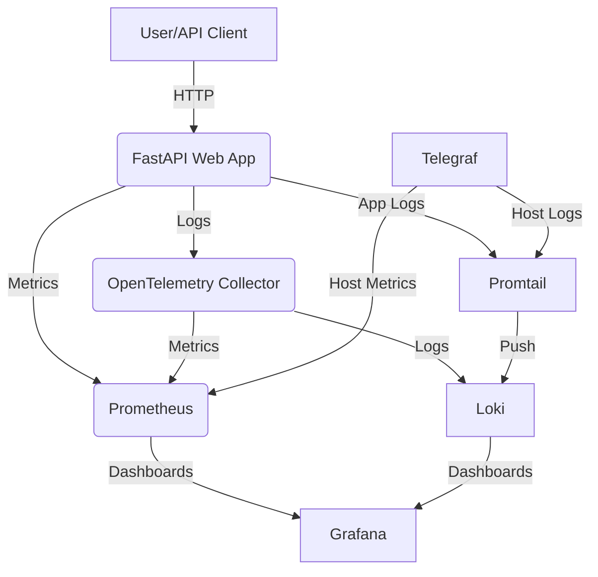

# 🚀 Enterprise Observability Pipeline with Telegraf, OpenTelemetry, Prometheus, Loki & Grafana


> **A modern, production-ready observability stack for Python apps, featuring FastAPI, Telegraf, OpenTelemetry Collector, Prometheus, Loki, and Grafana.**

---

## ✨ Features

- **FastAPI Web App** with Prometheus and OpenTelemetry instrumentation
- **Centralized Logging** with Loki & Promtail
- **Metrics Collection** via Telegraf & Prometheus
- **Distributed Tracing & Logs** with OpenTelemetry Collector
- **Beautiful Grafana Dashboards** for real-time monitoring
- **Docker Compose** for easy local deployment
- **Production-Ready JSON Logging**

---

## 🏗️ Architecture



---

## 📦 Stack Components

- **FastAPI**: Python web app with system state, load, and error endpoints
- **Telegraf**: Collects system metrics and writes to file
- **OpenTelemetry Collector**: Receives, processes, and exports logs/metrics
- **Prometheus**: Scrapes metrics from app, collector, and Telegraf
- **Loki**: Stores logs, queried by Grafana
- **Promtail**: Ships logs to Loki
- **Grafana**: Visualizes metrics and logs

---

## 🚀 Quick Start

### 1. Clone & Build

```bash
git clone https://github.com/Simar0024/Observability-Pipeline-Telegraf-OTel.git
cd Observability-Pipeline-Telegraf-OTel
docker-compose up --build
```

### 2. Access the Platform

- **FastAPI App**: [http://localhost:8000](http://localhost:8000)
- **Grafana**: [http://localhost:3000](http://localhost:3000)  
  _Default login: `admin` / `admin`_

---

## 🛠️ Endpoints

| Endpoint                  | Method | Description                                 |
|--------------------------|--------|---------------------------------------------|
| `/dashboard`             | GET    | Main dashboard (renders index.html)         |
| `/api/v1/system-state`   | GET    | Returns CPU, memory, threads, DB connections|
| `/api/v1/generate-load`  | GET    | Triggers CPU load for stress testing        |
| `/api/v1/trigger-error`  | GET    | Simulates an error (500) for diagnostics    |
| `/metrics`               | GET    | Prometheus metrics endpoint                 |

---

## ⚙️ Configuration Overview

- **app.py**: FastAPI app with Prometheus & OTEL logging
- **telegraf.conf**: Collects CPU, memory, disk metrics, outputs to file
- **otel-collector-config.yaml**: Receives OTLP, exports to Loki, Prometheus, file
- **prometheus.yml**: Scrapes metrics from app, collector, Telegraf
- **promtail-config.yaml**: Ships logs from app, Telegraf, collector to Loki
- **grafana/provisioning/datasources/datasources.yaml**: Pre-configures Loki & Prometheus datasources
- **dashboard.json / new-dashboard.json**: Grafana dashboards for metrics

---

## 📝 Example Dashboard Panels

- **CPU Utilization**
- **Memory Usage**
- **Active Threads**
- **DB Connections**
- **Log Streams**

---

## 🐳 Docker Compose Services

- `web-app`: FastAPI app (Python 3.11, Uvicorn)
- `telegraf`: System metrics collector
- `otel-collector`: OpenTelemetry Collector
- `loki`: Log aggregation
- `promtail`: Log shipper
- `prometheus`: Metrics database
- `grafana`: Visualization UI

---

## 📂 File Structure

```text
├── app.py
├── requirements.txt
├── docker-compose.yml
├── Dockerfile
├── telegraf.conf
├── otel-collector-config.yaml
├── prometheus.yml
├── promtail-config.yaml
├── dashboard.json
├── new-dashboard.json
├── index.html
├── grafana/
│   └── provisioning/
│       └── datasources/
│           └── datasources.yaml
└── logs/
```

---

## 🧩 Extending & Customizing

- Add new metrics/logs in `app.py` or `telegraf.conf`
- Update dashboards in Grafana UI, then export JSON
- Add new exporters/receivers in `otel-collector-config.yaml`

---

## 🦾 Requirements

- Docker & Docker Compose
- (Optional) Python 3.11+ for local app development

---

## 🤝 Credits

- [FastAPI](https://fastapi.tiangolo.com/)
- [OpenTelemetry](https://opentelemetry.io/)
- [Prometheus](https://prometheus.io/)
- [Grafana](https://grafana.com/)
- [Loki](https://grafana.com/oss/loki/)
- [Telegraf](https://www.influxdata.com/time-series-platform/telegraf/)

---

> _Made with ❤️ for modern observability!_
